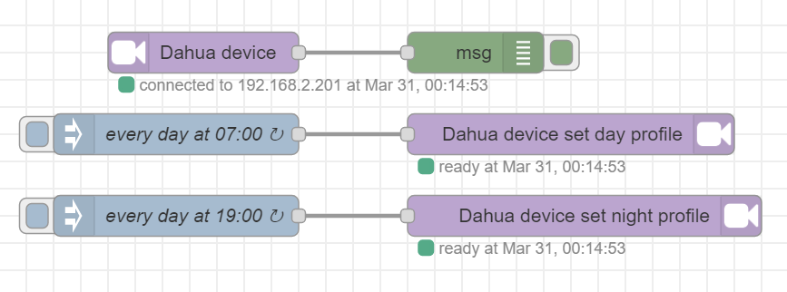

node-red-contrib-dahua-device
========================

Provides a node for grabbing Dahua DVR/NVR (digital video recorder) or IP-camera events like
<code>VideoMotion</code>, <code>AlarmLocal</code>, <code>VideoLoss</code> and <code>VideoBlind</code>.

Additionally it provides nodes to set Day or Night profile.

Supports digest authentication for the last Dahua firmware devices.

Install
-------

Debian based operation systems:

    sudo apt-get install build-essential git

Other operation systems: follow instructions https://github.com/nodejs/node-gyp#on-unix

### Installation:

Run the following command in your Node-RED user directory - typically `~/.node-red`

    npm i node-red-contrib-dahua-device

Usage
-----

Configure motion detection on a Dahua device. Drop the Dahua device node to a flow. 

If you want to trigger day or night profile, drop the Dahua device day / night node to a flow.

Example
-------

